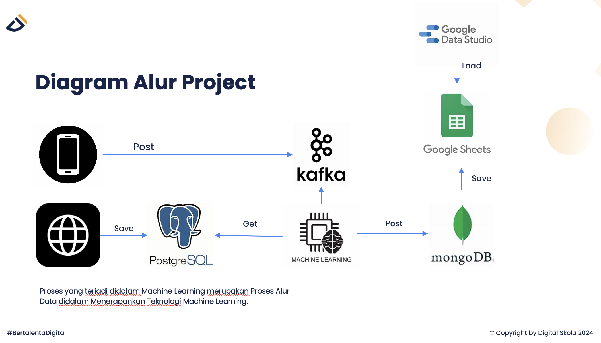

# Stream Processing with Kafka and MongoDB

## Project Overview

This project demonstrates stream processing using **Apache Kafka** and **MongoDB** in combination with **PostgreSQL** and **Machine Learning** models and create a dashboard using Google Data Studio. The goal is to process new and old data, make predictions using machine learning, and store and visualize the results.



### Data Flow Overview

1. **PostgreSQL** stores structured data (Old Information).
2. **Kafka** handles real-time streaming of new data (New Information).
3. **MongoDB** stores the processed data (including predictions).
4. **Google Sheets** is used for storing processed data.
5. **Google Data Studio** is used for creating a dashboard.

## Table of Tools

| Media | Function | Location |
| --- | --- | --- |
| **MongoDB** | Unstructured Data Storage | Virtual Machine / Local |
| **PostgreSQL** | Structured Data Storage | Virtual Machine / Local |
| **Apache Kafka** | Distributed Data Storage | Virtual Machine / Local |
| **Google Colab / Jupyter Lab** | Code Editor | Online / Local |
| **Google Spreadsheet** | Data Storage & Processing | Online |
| **Google Data Studio** | Dashboard Creation | Online |

## Project Workflow

### Pre-steps

- Activate Apache Kafka, MongoDB, and PostgreSQL connections. (Use Docker for easier setup)
- Download dataset and put inside producer folder https://drive.google.com/drive/folders/1cg2DAFy4hPtVtyA0LPQLG0yJnWoThWWR?usp=sharing
- Create google sheet to store data results
- Generate your own api key from googleapis
    
    Ref: https://medium.com/@techworldthink/accessing-google-sheet-data-with-python-a-practical-guide-using-the-google-sheets-api-dc57759d387a 
    

### Steps

1. **Data Dump**:
    - Dump **Old Information** (CSV) into **PostgreSQL** using **SQLAlchemy**.
2. **Kafka Producer**:
    - Create a Kafka producer to send **New Information** (CSV) into a Kafka topic.
3. **Kafka Consumer**:
    - Load **Old Information** from PostgreSQL.
    - Connect to **MongoDB**.
    - Consume **New Information** from the Kafka producer.
    - Merge **Old Information** from PostgreSQL and **New Information** from Kafka.
    - Process the merged data into **Feature Vectors** for input into a **Machine Learning Model** to generate predictions.
    - Merge the predictions with the initial data (Old + New Information).
    - Save the final data in **MongoDB**.
4. Create config.json to save credentials using this format

```python
{
    "database": {
      "username": "",
      "password": "",
      "host": "",
      "port": "",
      "database": ""
    },
    "kafka": {
      "bootstrap_servers": [""],
      "topic": ""
    },
    "mongodb": {
      "uri": "",
      "db": ""
    }
  }
```

5. **Google Sheets Integration**:
    - Save data from **MongoDB** to **Google Sheets** using the **python-googlesheet.ipynb** notebook.
    - Check out the data ingested to google sheet https://docs.google.com/spreadsheets/d/1Pe8zrsmryaVOC8ODuAt4QXHTl30WF5FbJPkuf7qVWVo/edit?gid=0#gid=0
6. **Dashboard**:
    - Use **Google Data Studio** to create a dashboard for visualizing the processed data.
    - Check out this Looker Studio dashboard https://lookerstudio.google.com/reporting/af53ce4f-b693-497c-b045-eb552dc731ed 

## Technologies Used

- **Apache Kafka**: Event streaming platform for real-time data ingestion.
- **MongoDB**: NoSQL database for storing processed unstructured data.
- **PostgreSQL**: Relational database for storing structured data.
- **SQLAlchemy**: Python ORM for interacting with PostgreSQL.
- **Kafka-python**: Python client for interacting with Kafka.
- **PyMongo**: Python client for interacting with MongoDB.
- **Google Sheets API**: Python library for interacting with Google Sheets.
- **Machine Learning**: The ML model used to make predictions from the data.
- **Google Data Studio**: Visualization tool for creating the final dashboard.

## Setup Instructions

### 1. Clone the Repository

```bash
git clone https://github.com/jeanneta/stream-processing-kafka-mongodb.git
cd stream-processing-kafka-mongodb
```

## Usage

### 1. Run the Data Dump

Dump **Old Information** (CSV) into **PostgreSQL**.

```bash
python dump_data.py
```

### 2. Run Kafka Producer

Send **New Information** (CSV) to **Kafka**.

```bash
python producer.py
```

### 3. Run Kafka Consumer

Process the data, merge **Old Information** and **New Information**, and save the result into **MongoDB**.

```bash
python consumer.py
```

### 4. Save Data to Google Sheets

Use **python-googlesheet.ipynb** to dump data from **MongoDB** to **Google Sheets**.

```bash
python python-googlesheet.ipynb
```

### 5. Create Dashboard

Use **Google Data Studio** to connect your **Google Sheets** and create the final data visualization dashboard.

## Data Flow

1. **Kafka Producer** pushes **New Information** (CSV) into Kafka.
2. **Kafka Consumer** processes both **Old Information** (PostgreSQL) and **New Information** (Kafka), merges them, applies machine learning models, and stores the results in **MongoDB**.
3. Data is then dumped into **Google Sheets** and visualized using **Google Data Studio**.